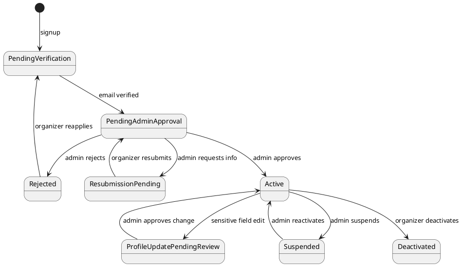
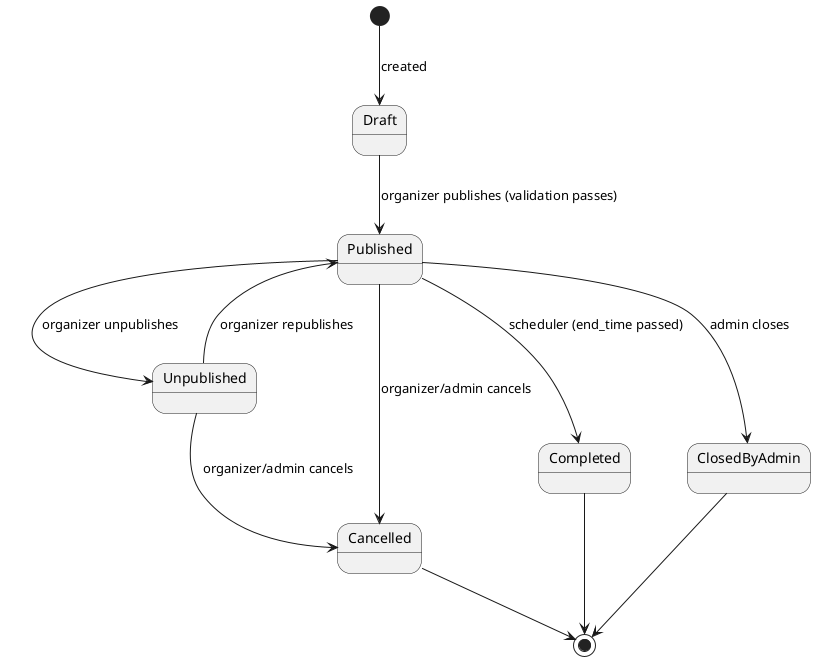
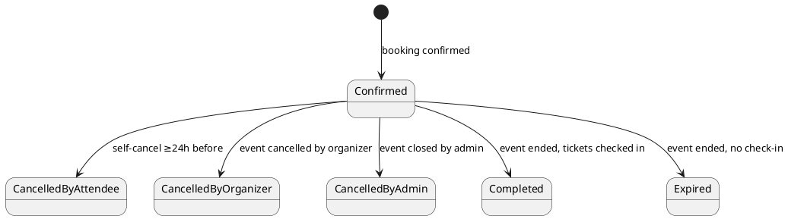
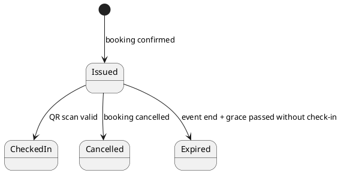
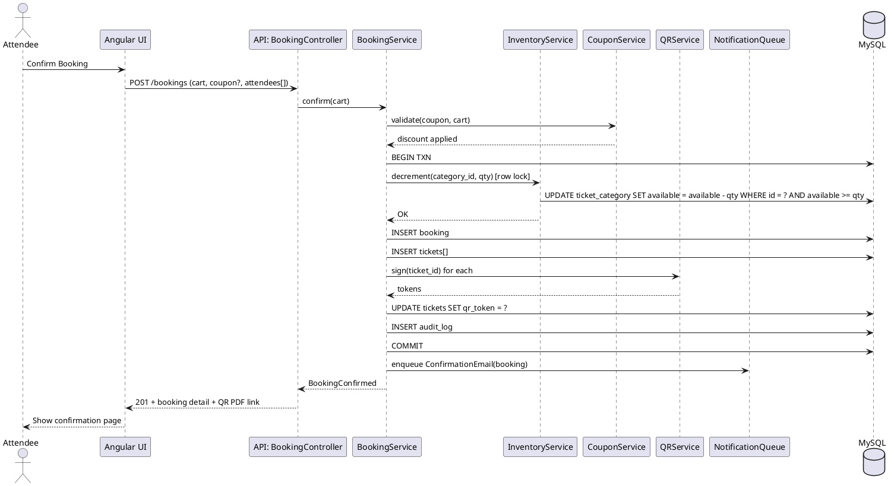
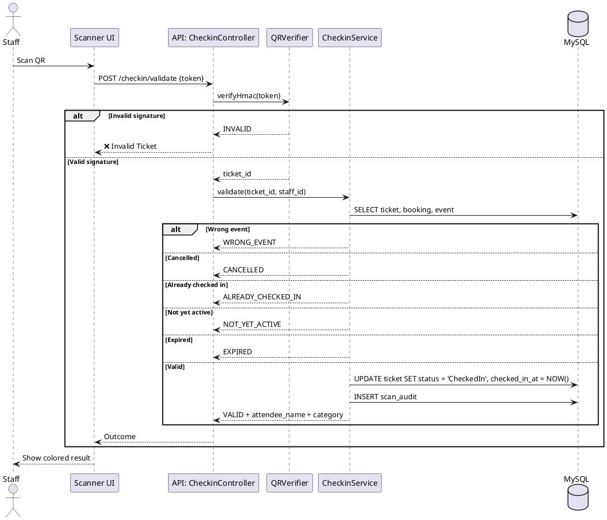

# 05 — UML Use Cases

**Project:** Smart Event Management & Ticket Booking Platform
**Version:** V1.0
**Date:** 2026-05-05

> Diagrams are written in **PlantUML** so they can be rendered in any PlantUML tool (VS Code extension, plantuml.com, IntelliJ, etc.).

---

## 1. Actors

| Actor | Description |
|-------|-------------|
| **Guest** | Unauthenticated visitor (browse / search public events only) |
| **Attendee** | Registered customer who books tickets |
| **Organizer** | Approved event host |
| **Check-in Staff** | Organizer-created operator for ticket validation |
| **Super Admin** | Platform owner with governance powers |
| **System Scheduler** | Time-based job runner (auto-completion, reminders) |
| **SMTP Service** | External email delivery dependency |

---

## 2. System-Level Use Case Diagram

```plantuml
@startuml SystemUseCases
left to right direction
skinparam packageStyle rectangle

actor Guest
actor Attendee
actor Organizer
actor "Check-in Staff" as Staff
actor "Super Admin" as Admin
actor "Scheduler" as Sched
actor "SMTP Service" as SMTP

rectangle "Smart Event Management & Ticket Booking Platform" {

  package "Public" {
    usecase "Browse Events" as UC_Browse
    usecase "Search & Filter" as UC_Search
    usecase "View Event Detail" as UC_Detail
    usecase "View Static Pages" as UC_Static
  }

  package "Identity" {
    usecase "Register Attendee" as UC_RegA
    usecase "Register Organizer" as UC_RegO
    usecase "Verify Email" as UC_Verify
    usecase "Login" as UC_Login
    usecase "Forgot Password" as UC_Fpwd
    usecase "Manage Profile" as UC_Profile
    usecase "Deactivate Account" as UC_Deact
  }

  package "Organizer Mgmt" {
    usecase "Review Pending Organizers" as UC_Queue
    usecase "Approve Organizer" as UC_Approve
    usecase "Reject Organizer" as UC_Reject
    usecase "Request Resubmission" as UC_Resub
    usecase "Suspend Organizer" as UC_Susp
    usecase "Reactivate Organizer" as UC_React
  }

  package "Event" {
    usecase "Create Event Draft" as UC_Draft
    usecase "Configure Tickets" as UC_Tkt
    usecase "Publish Event" as UC_Pub
    usecase "Edit Event" as UC_Edit
    usecase "Unpublish Event" as UC_Unpub
    usecase "Cancel Event" as UC_Cancel
    usecase "Close Event (Admin)" as UC_AdmClose
    usecase "Auto-Complete Event" as UC_AutoComp
  }

  package "Booking" {
    usecase "Book Tickets" as UC_Book
    usecase "Apply Coupon" as UC_Coupon
    usecase "View My Bookings" as UC_MyBk
    usecase "Cancel Booking" as UC_CancelBk
    usecase "Re-download QR" as UC_Redown
  }

  package "Coupon" {
    usecase "Manage Organizer Coupons" as UC_OCoup
    usecase "Manage Global Coupons" as UC_GCoup
  }

  package "Check-in" {
    usecase "Scan QR Ticket" as UC_Scan
    usecase "Manual Lookup" as UC_Manual
    usecase "View Check-in Audit" as UC_Audit
  }

  package "Review" {
    usecase "Submit Review" as UC_Review
    usecase "Remove Abusive Review" as UC_RmRev
  }

  package "Reporting" {
    usecase "View Admin Dashboard" as UC_AdmDash
    usecase "View Organizer Dashboard" as UC_OrgDash
    usecase "View Attendee Dashboard" as UC_AttDash
    usecase "Export CSV Reports" as UC_CSV
  }

  package "Notifications" {
    usecase "Send Email" as UC_Email
    usecase "Send Reminders" as UC_Remind
    usecase "Retry Failed Emails" as UC_Retry
  }
}

Guest --> UC_Browse
Guest --> UC_Search
Guest --> UC_Detail
Guest --> UC_Static
Guest --> UC_RegA
Guest --> UC_RegO
Guest --> UC_Login
Guest --> UC_Fpwd
Guest --> UC_Verify

Attendee --> UC_Browse
Attendee --> UC_Detail
Attendee --> UC_Book
Attendee --> UC_Coupon
Attendee --> UC_MyBk
Attendee --> UC_CancelBk
Attendee --> UC_Redown
Attendee --> UC_Review
Attendee --> UC_AttDash
Attendee --> UC_Profile
Attendee --> UC_Deact

Organizer --> UC_Draft
Organizer --> UC_Tkt
Organizer --> UC_Pub
Organizer --> UC_Edit
Organizer --> UC_Unpub
Organizer --> UC_Cancel
Organizer --> UC_OCoup
Organizer --> UC_OrgDash
Organizer --> UC_CSV
Organizer --> UC_Profile

Staff --> UC_Scan
Staff --> UC_Manual

Admin --> UC_Queue
Admin --> UC_Approve
Admin --> UC_Reject
Admin --> UC_Resub
Admin --> UC_Susp
Admin --> UC_React
Admin --> UC_AdmClose
Admin --> UC_GCoup
Admin --> UC_RmRev
Admin --> UC_AdmDash
Admin --> UC_CSV
Admin --> UC_Audit

Sched --> UC_AutoComp
Sched --> UC_Remind
Sched --> UC_Retry

UC_Email --> SMTP
@enduml
```

---

## 3. Detailed Use Case Specifications (Critical Flows)

### UC-01 — Register Attendee

| Field | Value |
|-------|-------|
| **Actor** | Guest |
| **Goal** | Create a new attendee account |
| **Preconditions** | Email not already registered |
| **Trigger** | Guest clicks "Sign Up" |
| **Main Flow** | 1. Guest enters profile fields + password. 2. System validates fields and password policy. 3. System creates account in `Pending Verification` state. 4. System sends verification email via SMTP. 5. Guest clicks verification link. 6. System transitions account to `Active`. |
| **Alternate** | (3a) Email already exists → show error. (4a) SMTP fails → retry queue, show "check email later". |
| **Postcondition** | Attendee can log in. |

### UC-02 — Register Organizer & Approval

| Field | Value |
|-------|-------|
| **Actor** | Guest, Super Admin |
| **Goal** | Onboard organizer and obtain approval |
| **Main Flow** | 1. Guest submits organizer signup with profile + optional docs. 2. System creates account `Pending Verification`. 3. Email verification → `Pending Admin Approval`. 4. Super Admin opens queue. 5. Admin chooses Approve / Reject / Resubmit. 6. Status transitions; email sent. 7. If Approved → organizer can publish events. |
| **Alternate** | (5a) Reject requires reason. (5b) Resubmit requires comments; organizer edits + resubmits. |
| **Postcondition** | Organizer state determined; audit logged. |

### UC-03 — Create & Publish Event

| Field | Value |
|-------|-------|
| **Actor** | Organizer |
| **Preconditions** | Organizer is `Active` |
| **Main Flow** | 1. Organizer creates Draft (mandatory + conditional fields). 2. Adds 1–10 ticket categories with qty > 0. 3. Uploads banner. 4. Reviews pre-publish validation. 5. Clicks Publish. 6. System transitions to `Published`; event becomes searchable. |
| **Alternate** | (4a) Validation fails → show errors. (5a) Sale window optional; defaults to publish-time → event start. |

### UC-04 — Book Tickets

| Field | Value |
|-------|-------|
| **Actor** | Attendee |
| **Preconditions** | Logged in; event published; sale open; inventory > 0 |
| **Main Flow** | 1. Select event detail. 2. Choose categories + quantities (≤ 10 total, within per-category min/max). 3. Optionally apply coupon. 4. Enter per-ticket attendee names. 5. Accept T&C. 6. Click Confirm. 7. System atomically: validate inventory, decrement, persist booking + tickets, generate QR tokens, write audit, queue email. 8. Show confirmation page with QR PDF + ICS download. |
| **Alternate** | (7a) Inventory insufficient → reject with friendly error. (7b) Coupon invalid → show error, allow retry without coupon. |

### UC-05 — QR Check-in

| Field | Value |
|-------|-------|
| **Actor** | Check-in Staff |
| **Preconditions** | Staff logged in; assigned to event; event within scan window (start ≤ now ≤ end + 2h) |
| **Main Flow** | 1. Staff opens scanner. 2. Camera reads QR token. 3. System verifies HMAC, looks up ticket. 4. System checks: ticket status = Issued, event matches assignment, within active window, not already checked in. 5. System marks ticket Checked In, writes audit log. 6. UI shows ✅ Valid + attendee name + category. |
| **Alternate Outcomes** | Already Checked In, Invalid Token, Wrong Event, Cancelled, Expired, Not Yet Active. Each shown with distinct color and message. |

### UC-06 — Cancel Booking (Attendee)

| Field | Value |
|-------|-------|
| **Actor** | Attendee |
| **Preconditions** | Booking is `Confirmed`; current time ≤ event start − 24 hours |
| **Main Flow** | 1. Attendee opens booking detail. 2. Clicks Cancel. 3. Confirms. 4. System transitions booking & all tickets to Cancelled, returns inventory, invalidates QR tokens, queues cancellation email. |
| **Alternate** | (Pre-cond fail) Show "Cancellation window closed". |

### UC-07 — Cancel Event (Organizer)

| Field | Value |
|-------|-------|
| **Actor** | Organizer |
| **Main Flow** | 1. Organizer opens event. 2. Clicks Cancel + provides reason. 3. System transitions event to Cancelled, marks all bookings Cancelled by Organizer, invalidates all QR tokens, queues notification email to all attendees, writes audit. |

### UC-08 — Auto-Complete Event (Scheduler)

| Field | Value |
|-------|-------|
| **Actor** | System Scheduler |
| **Trigger** | Cron every 15 minutes |
| **Main Flow** | 1. Find events with status `Published` AND `end_time < now`. 2. Transition to `Completed`. 3. Queue post-event feedback emails. 4. Mark `Issued` tickets as `Expired` after `end_time + 2h`. |

---

## 4. State Diagrams

### 4.1 Organizer Account State Machine

### 4.2 Event Lifecycle State Machine

### 4.3 Booking State Machine

### 4.4 Ticket State Machine

---

## 5. Sequence Diagram — Booking Flow

---

## 6. Sequence Diagram — Check-in Flow

---

**End of UML Use Cases**
